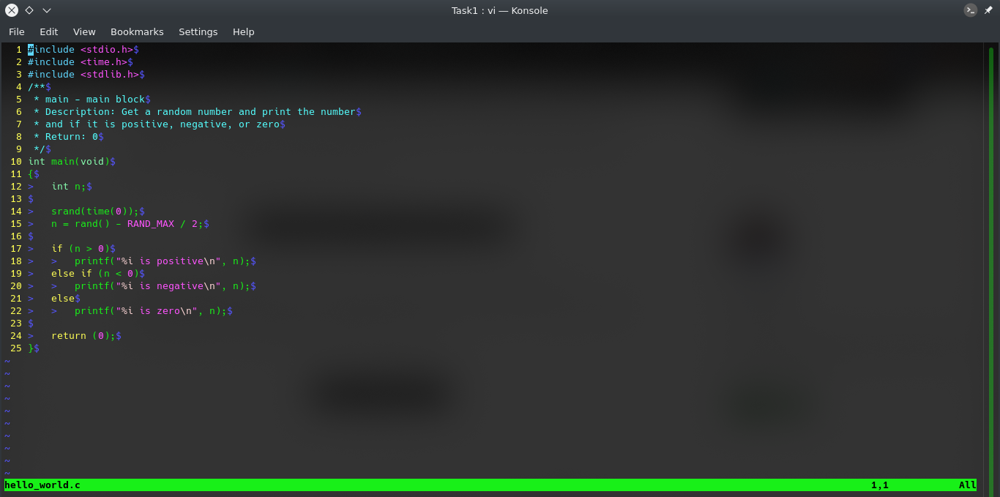
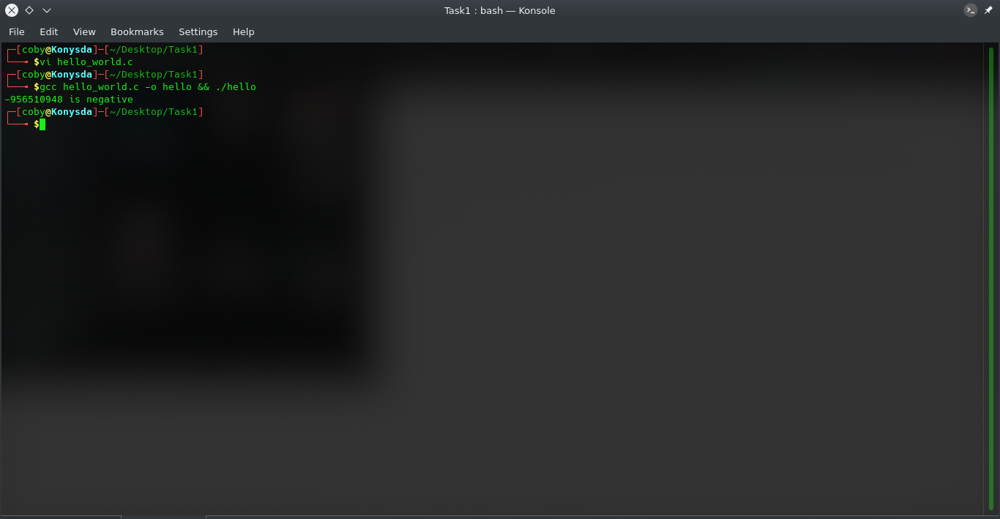

# Task1
Task to demonstrate the use of Git and Github

##### WHAT IS GIT

•Git is a distributed version control system that lets you manage and keep track of your source code. It was developed by Linus Torvalds(Bonus Tip

#####  WHAT IS GITHUB

•Github is a web-based Git repository hosting Git repository for teams to store their code in a centralized location. GitHub offers all the distributed revision control and source code management (S0CM) functionality of Git as well as adding its own features.
Github was acquired by Microsoft(Bonus Tip).

#### Simple C Program To Determine If a Random Number is Positive or Negative
To begin with , kindly take note:
##### Prerequisites
C Programming Knowledge(Basics)
Linux Environmnent 
Vi Editor Navigaton
GCC Flags 
##### Environment
Linux Terminal
##### Editor
Vi 
##### Compilation and Execution
gcc

Open your favorite code editor for me it's Vi

Enter the following code below:

To execute the code:

  
